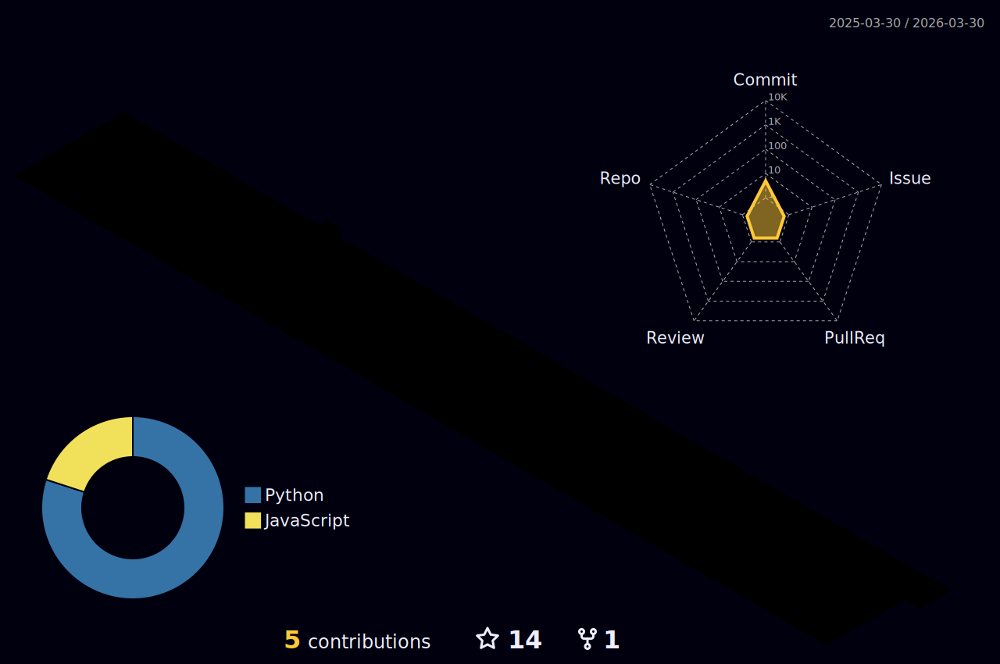

<h1 align="center">Hi, I'm Sadik Hossain Siam</h1>

<div align="center">


</div>
<!-- <h3 align="center">A passionate frontend developer from Bangladesh.</h3> -->

<!-- I am a frontend focused full stack web app developer. I am always learning new stuff and I enjoy web development.

- 💬 Ask me about Web app/ Javascript.

- 🌱 I’m currently learning **MERN Stack | Docker | Kubernetes | AWS**

- 💬 Ask me about **Web Development** -->
<br/>

<p align="center">


<a href="https://github.com/Sadik-Hossain?tab=repositories" target="blank">

</a>


<a href="https://www.youtube.com/channel/UCVcSaa4eoHzPGoTYbMmIPBg" target="blank">

</a>
</p>

<br/>
<!--  -->
<p align="center">


</p>

## Connect with me 

[](https://discord.com/channels/1036326353198395393/1036326354557345874)&nbsp;&nbsp;
[](https://twitter.com/sadikhossainsam)&nbsp;&nbsp;
[](https://linkedin.com/in/sadik-hossain-siam/)&nbsp;&nbsp;
[](https://stackoverflow.com/users/users/18439750/sadik-h)&nbsp;&nbsp;
[](https://fb.com/web.sadik.h/)

<details>
  <summary><h3 align="top">My followers&nbsp;</h3></summary>

<!--START_SECTION:top-followers-->
<table>
  <tr>
    <td align="center">
      <a href="https://github.com/NishatFariza">
        
      </a>
      <br />
      <a href="https://github.com/NishatFariza">Nisat Fariza</a>
    </td>
    <td align="center">
      <a href="https://github.com/RiyaadHossain">
        
      </a>
      <br />
      <a href="https://github.com/RiyaadHossain">Riyad Hossain</a>
    </td>
    <td align="center">
      <a href="https://github.com/HamidAli21">
        
      </a>
      <br />
      <a href="https://github.com/HamidAli21">Mohd Hamid Ali</a>
    </td>
    <td align="center">
      <a href="https://github.com/sadikhossain123">
        
      </a>
      <br />
      <a href="https://github.com/sadikhossain123">void_m1p</a>
    </td>
  </tr>
</table>
<!--END_SECTION:top-followers-->
  </details>

<br/>
<!-- <h3 align="left">Connect with me:</h3> -->

<!-- <p align="left"> -->

<!-- <a href="https://twitter.com/sadikhossainsam" target="blank"></a> -->
<!-- <a href="https://linkedin.com/in/sadik-hossain-siam/" target="blank"></a> -->

<!-- <a href="https://stackoverflow.com/users/users/18439750/sadik-h" target="blank"></a> -->

<!-- <a href="https://fb.com/web.sadik.h/" target="blank"></a> -->

<!-- </p> -->

<!-- <h3 align="left">Languages and Tools:</h3>
<div style="background-color:#fff">
<p align="left"> <a href="https://getbootstrap.com" target="_blank" rel="noreferrer">  </a> <a href="https://www.w3schools.com/css/" target="_blank" rel="noreferrer">  </a> <a href="https://www.figma.com/" target="_blank" rel="noreferrer">  </a> <a href="https://firebase.google.com/" target="_blank" rel="noreferrer">  </a> <a href="https://git-scm.com/" target="_blank" rel="noreferrer">  </a> <a href="https://www.w3.org/html/" target="_blank" rel="noreferrer">  </a> <a href="https://developer.mozilla.org/en-US/docs/Web/JavaScript" target="_blank" rel="noreferrer">  </a> <a href="https://www.mongodb.com/" target="_blank" rel="noreferrer">  </a> <a href="https://nextjs.org/" target="_blank" rel="noreferrer">  </a> <a href="https://nodejs.org" target="_blank" rel="noreferrer">  </a> <a href="https://reactjs.org/" target="_blank" rel="noreferrer">  </a> <a href="https://tailwindcss.com/" target="_blank" rel="noreferrer">  </a> </p></div>
<hr/>
<p align="center"></p>
<hr/>
<p align="center" ></p>
<hr/>
<p align="center"></p>
<p align="center"></p> -->

## Language Tech and tools 

<p align="left">
<a href="#">

</a>
<a href="#">

</a>
<a href="https://tailwind.com/">

</a>
<a href="https://getbootstrap.com/">

</a>
<a href="https://www.figma.com/">

</a>
<a href="https://developer.mozilla.org/">

</a>
<a href="https://reactjs.org/">

</a>
<a href="https://redux.js.org/">

</a>
<a href="https://firebase.google.com/">

</a>
<a href="https://nodejs.org/en/">

</a>
  <a href="https://expressjs.com/">
    
  </a>
  <a href="https://www.mongodb.com/">
    
  </a>
  <a href="https://restfulapi.net/">
    
  </a>
  <a href="https://www.postman.com/">
    
  </a>
  <a href="https://git-scm.com/">
    
  </a>
  <a href="https://github.com/">
    
  </a>
  <a href="https://www.linux.org/">
    
  </a>
  <a href="https://www.netlify.com/">
    
  </a>
  <a href="https://vercel.com/">
    
  </a>
  <a href="https://nextjs.org/">
    
  </a>
  <a href="https://www.typescriptlang.org/">
    
  </a>
  <a href="https://ubuntu.com/">
    
  </a>
  <a href="https://www.microsoft.com/en-us/windows">
    
  </a>
  <a href="https://code.visualstudio.com/">
    
  </a>
  <a href="https://vitejs.dev/">
    
  </a>
  <a href="https://www.npmjs.com/">
    
  </a>
  <a href="https://yarnpkg.com/">
    
  </a>

  <a href="https://www.webrtc.org/">
    
  </a>
  <a href="https://www.docker.com/">
    
  </a>
   <a href="https://axios-http.com/">
    
  </a>
  <a href="https://mongoosejs.com/">
    
  </a>
   <a href="https://socket.io/">
    
  </a>
  <a href="https://reactrouter.com">
    
  </a>
  
  
</p>
<!--snake eating graph  🐍-->
<br/>

## Snake eating my contribution 


<!-- github-contribution-grid-snake-dark.svg#gh-dark-mode-only -->

<!--START_SECTION:waka-->


**🐱 My GitHub Data** 

> 🏆 2,988 Contributions in the Year 2022
 > 
> 📦 94.8 kB Used in GitHub's Storage 
 > 
> 💼 Opted to Hire
 > 
> 📜 72 Public Repositories 
 > 
> 🔑 24 Private Repositories  
 > 
**I'm a Night 🦉** 

```text
🌞 Morning    78 commits     ⬛⬛⬜⬜⬜⬜⬜⬜⬜⬜⬜⬜⬜⬜⬜⬜⬜⬜⬜⬜⬜⬜⬜⬜⬜   9.2% 
🌆 Daytime    250 commits    ⬛⬛⬛⬛⬛⬛⬛⬜⬜⬜⬜⬜⬜⬜⬜⬜⬜⬜⬜⬜⬜⬜⬜⬜⬜   29.48% 
🌃 Evening    434 commits    ⬛⬛⬛⬛⬛⬛⬛⬛⬛⬛⬛⬛⬜⬜⬜⬜⬜⬜⬜⬜⬜⬜⬜⬜⬜   51.18% 
🌙 Night      86 commits     ⬛⬛⬜⬜⬜⬜⬜⬜⬜⬜⬜⬜⬜⬜⬜⬜⬜⬜⬜⬜⬜⬜⬜⬜⬜   10.14%

```
📅 **I'm Most Productive on Friday** 

```text
Monday       110 commits    ⬛⬛⬛⬜⬜⬜⬜⬜⬜⬜⬜⬜⬜⬜⬜⬜⬜⬜⬜⬜⬜⬜⬜⬜⬜   12.97% 
Tuesday      107 commits    ⬛⬛⬛⬜⬜⬜⬜⬜⬜⬜⬜⬜⬜⬜⬜⬜⬜⬜⬜⬜⬜⬜⬜⬜⬜   12.62% 
Wednesday    85 commits     ⬛⬛⬜⬜⬜⬜⬜⬜⬜⬜⬜⬜⬜⬜⬜⬜⬜⬜⬜⬜⬜⬜⬜⬜⬜   10.02% 
Thursday     48 commits     ⬛⬜⬜⬜⬜⬜⬜⬜⬜⬜⬜⬜⬜⬜⬜⬜⬜⬜⬜⬜⬜⬜⬜⬜⬜   5.66% 
Friday       242 commits    ⬛⬛⬛⬛⬛⬛⬛⬜⬜⬜⬜⬜⬜⬜⬜⬜⬜⬜⬜⬜⬜⬜⬜⬜⬜   28.54% 
Saturday     145 commits    ⬛⬛⬛⬛⬜⬜⬜⬜⬜⬜⬜⬜⬜⬜⬜⬜⬜⬜⬜⬜⬜⬜⬜⬜⬜   17.1% 
Sunday       111 commits    ⬛⬛⬛⬜⬜⬜⬜⬜⬜⬜⬜⬜⬜⬜⬜⬜⬜⬜⬜⬜⬜⬜⬜⬜⬜   13.09%

```


📊 **This Week I Spent My Time On** 

```text
⌚︎ Time Zone: Asia/Dhaka

💬 Programming Languages: 
JavaScript               3 hrs 3 mins        ⬛⬛⬛⬛⬛⬛⬛⬛⬛⬛⬛⬛⬛⬛⬛⬛⬛⬛⬛⬛⬛⬜⬜⬜⬜   85.8% 
HTML                     27 mins             ⬛⬛⬛⬜⬜⬜⬜⬜⬜⬜⬜⬜⬜⬜⬜⬜⬜⬜⬜⬜⬜⬜⬜⬜⬜   12.89% 
CSS                      0 secs              ⬜⬜⬜⬜⬜⬜⬜⬜⬜⬜⬜⬜⬜⬜⬜⬜⬜⬜⬜⬜⬜⬜⬜⬜⬜   0.42% 
JSON                     0 secs              ⬜⬜⬜⬜⬜⬜⬜⬜⬜⬜⬜⬜⬜⬜⬜⬜⬜⬜⬜⬜⬜⬜⬜⬜⬜   0.34% 
Git Config               0 secs              ⬜⬜⬜⬜⬜⬜⬜⬜⬜⬜⬜⬜⬜⬜⬜⬜⬜⬜⬜⬜⬜⬜⬜⬜⬜   0.29%

🔥 Editors: 
VS Code                  3 hrs 33 mins       ⬛⬛⬛⬛⬛⬛⬛⬛⬛⬛⬛⬛⬛⬛⬛⬛⬛⬛⬛⬛⬛⬛⬛⬛⬛   100.0%

💻 Operating System: 
Windows                  3 hrs 33 mins       ⬛⬛⬛⬛⬛⬛⬛⬛⬛⬛⬛⬛⬛⬛⬛⬛⬛⬛⬛⬛⬛⬛⬛⬛⬛   100.0%

```

**I Mostly Code in JavaScript** 

```text
JavaScript               64 repos            ⬛⬛⬛⬛⬛⬛⬛⬛⬛⬛⬛⬛⬛⬛⬛⬛⬛⬛⬛⬛⬜⬜⬜⬜⬜   80.0% 
HTML                     11 repos            ⬛⬛⬛⬜⬜⬜⬜⬜⬜⬜⬜⬜⬜⬜⬜⬜⬜⬜⬜⬜⬜⬜⬜⬜⬜   13.75% 
Python                   1 repo              ⬜⬜⬜⬜⬜⬜⬜⬜⬜⬜⬜⬜⬜⬜⬜⬜⬜⬜⬜⬜⬜⬜⬜⬜⬜   1.25% 
CSS                      1 repo              ⬜⬜⬜⬜⬜⬜⬜⬜⬜⬜⬜⬜⬜⬜⬜⬜⬜⬜⬜⬜⬜⬜⬜⬜⬜   1.25% 
Go                       1 repo              ⬜⬜⬜⬜⬜⬜⬜⬜⬜⬜⬜⬜⬜⬜⬜⬜⬜⬜⬜⬜⬜⬜⬜⬜⬜   1.25%

```


 Last Updated on 02/12/2022 12:17:39 UTC
<!--END_SECTION:waka-->


